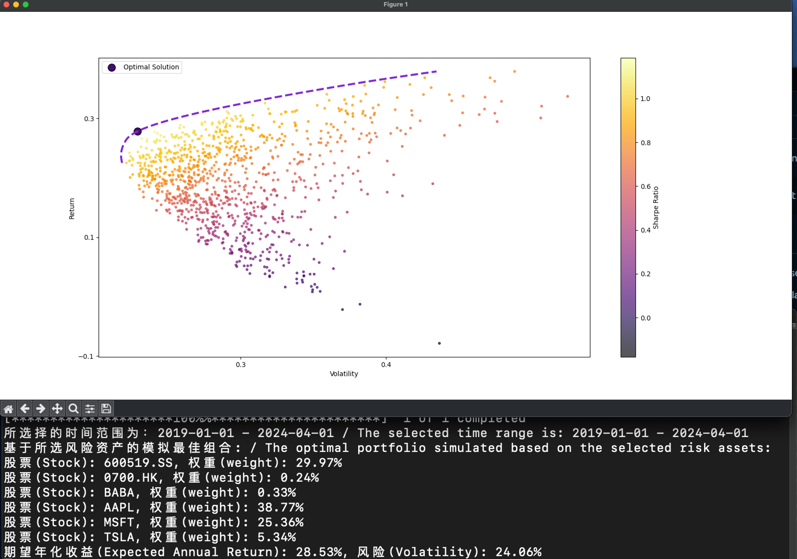

## About / 关于
代码计算部分主要参考Fábio Neves的文章，你可以在他的文章中找到一些细节性的解释(https://towardsdatascience.com/python-markowitz-optimization-b5e1623060f5), 我在此基础之上增加了对雅虎财经API的调用，可以直接使用股票代码计算。Weighs我用的是狄利克雷分布来生成权重而不是默认的均匀分布，这样可以权重之和为1。

The calculation part of the code is mainly based on Fábio Neves' article, where you can find more detailed explanations: (https://towardsdatascience.com/python-markowitz-optimization-b5e1623060f5), to which I added a integrate the Yahoo Finance API, allowing the calculation to be done directly using the stock codes. For weighs I have used the Dirichlet distribution to generate the weights instead of the default uniform distribution so that the sum of the weights is 1.

## 安装与使用指南 / Installation and Usage Guide

### 安装依赖 / Install Dependencies

在项目文件夹中，使用以下命令安装依赖：

In the project folder, install the dependencies using the following command:

```
pip install -r requirements.txt
```

### 使用方法 / How to Use
1. 在portfolio.py中设置以下参数 / In the code file portfolio.py, set the following parameters:
    - 数据起始日期 / Data start date （start_date）
    - 数据结束日期 / Data end date（end_date）
    - 股票代码数组 / Stock code array（data_array）

2. 在命令行中，执行以下命令运行代码 / In the command line, run the code with the following command:：

```
python portfolio.py
```

## 一些说明 / A few notes

- 修改起始时间`start_date`和`end_date`。需要注意有些公司上市时间可能比较迟，例如B站是在2018年上市，如果你的开始时间是从2015年开始，那么结果可能会不准确。
Modify the start and end dates, `start_date` and `end_date`. Please note that some companies may have been listed later, e.g., Bilibili was listed in 2018, so if your start date is 2015, the results may be inaccurate.


- 修改和添加`data_array`中的资产代号，数量没有限制，这里使用的是雅虎财经的API，你可以在搜索引擎中以「公司名+雅虎财经（Yahoo Finance）」搜索对应公司代号。例如茅台是「600519.SS」，苹果是「AAPL」，腾讯是「0700.HK」。
Change or add asset codes in the `data_array`. There is no limit to the number of assets. This code uses the Yahoo Finance API, and you can search for the company code in search engines with "company name + Yahoo Finance". For example, Maotai is "600519.SS", Apple is "AAPL", and Tencent is "0700.HK".


- 如果运算时间过长，你可以尝试降低`sample_num`的数值。
If the calculation takes too long, you can try reducing the value of `sample_num`.

- 计算结果仅供参考。投资有风险，入市需谨慎。
The calculation results are for reference only. Investing carries risks, and you should be cautious when entering the market.


